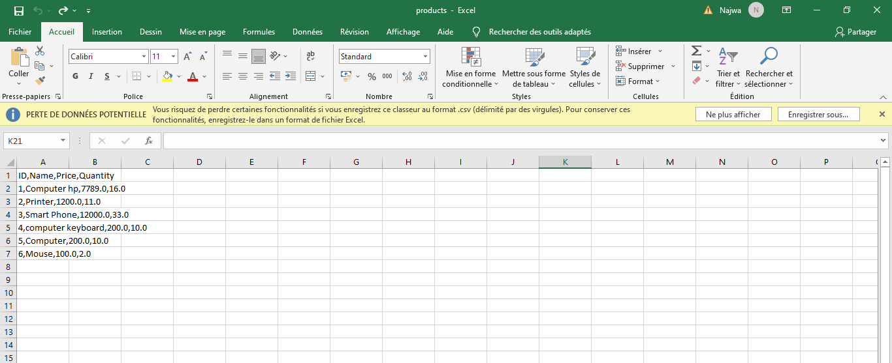
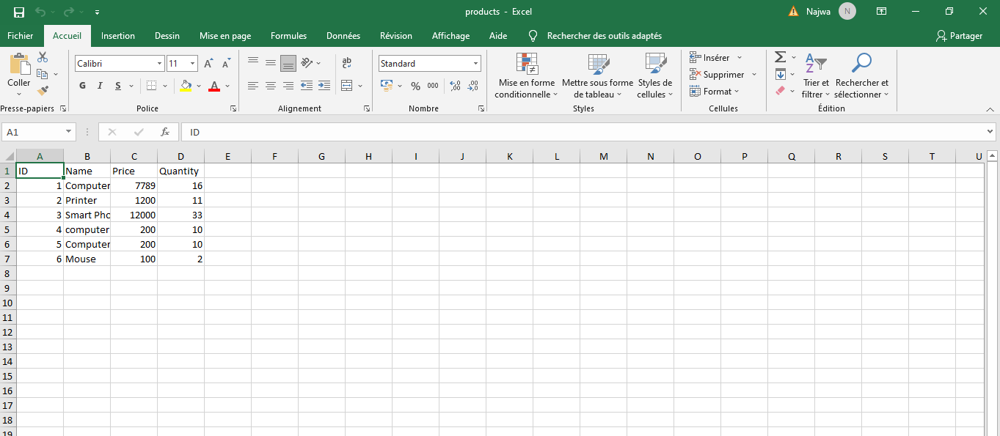
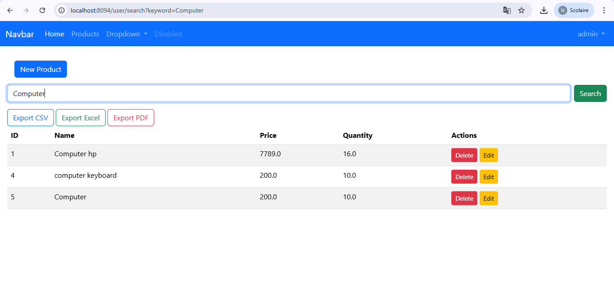
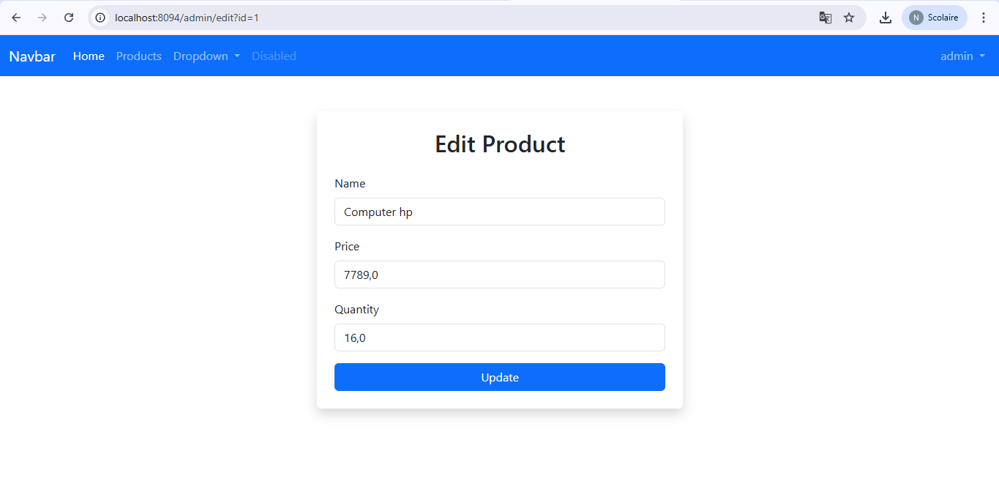
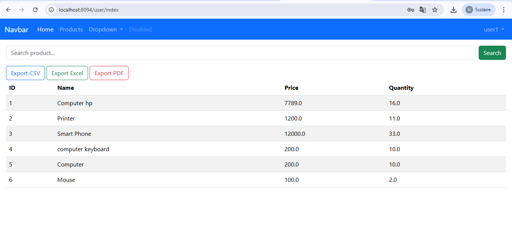
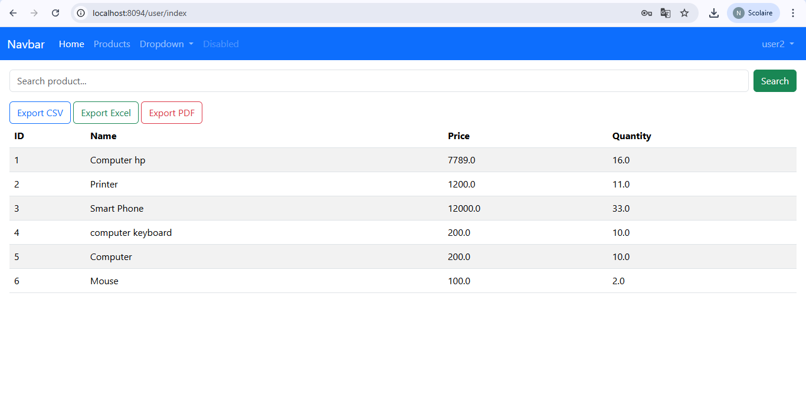

# GestionProduit_Spring-Thymeleaf

GestionProduit_Spring-Thymeleaf est une application web pour gérer des produits, développée avec **Java Spring Boot** et **Thymeleaf**. Ce projet permet d'ajouter, modifier, supprimer et lister des produits dans une interface web simple et intuitive.

---

## 🚀 Fonctionnalités

Authentification pour admin et utilisateurs

Gestion des produits : création, lecture, mise à jour, suppression

Import de produits depuis CSV et Excel

Recherche et filtrage de produits

Interface web responsive avec Thymeleaf

---

## 🛠 Technologies utilisées

- **Java 21** : 
- **Spring Boot** : framework pour le backend
- **Thymeleaf** : moteur de templates pour le frontend
- **Maven** : gestion des dépendances
- **Bootstrap 5** : pour le design responsive (optionnel selon ton projet)
- **H2/MySQL** : base de données (selon configuration)

---

## 📁 Structure du projet

GestionProduit_Spring-Thymeleaf/
│
├─ src/main/java/com/example/gestionproduit/ # Code source Java
│ ├─ controller/ # Contrôleurs Spring MVC
│ ├─ model/ # Entités et modèles
│ └─ repository/ # Repositories pour la BD
│
├─ src/main/resources/
│ ├─ templates/ # Pages Thymeleaf (.html)
│ └─ application.properties # Configuration Spring Boot
│
├─ pom.xml # Gestion Maven
└─ README.md # Ce fichier

---
## 🖼️ Captures d’écran

- **Home Page** 

- **Admin Login** 

- **User Login** 

- **Products CSV** 

- **Products Excel** 

- **Search Page** 

- **Update Product** 

- **User1 Page** 

- **User2 Page**


---

## ⚡ Installation et lancement

1. **Cloner le dépôt :**

```bash
git clone https://github.com/najwamoukhliss/GestionProduit_Spring-Thymeleaf.git
cd GestionProduit_Spring-Thymeleaf