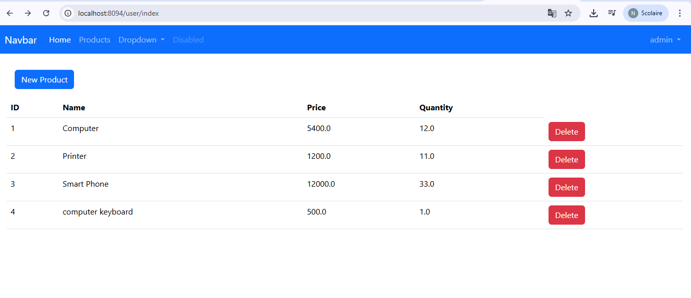
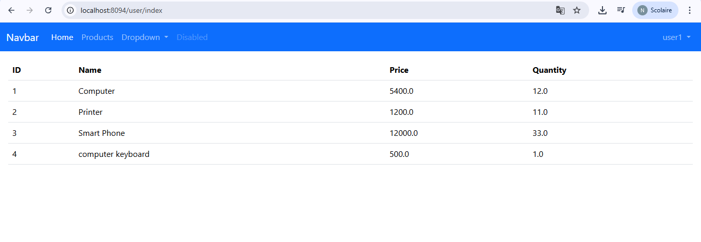
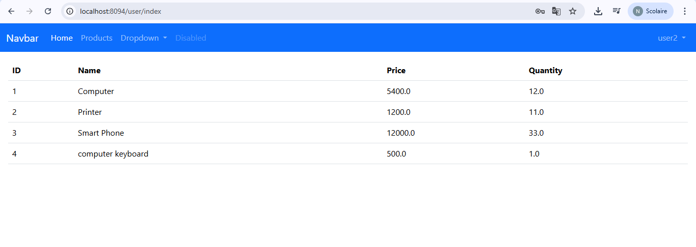
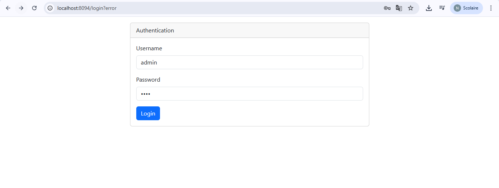
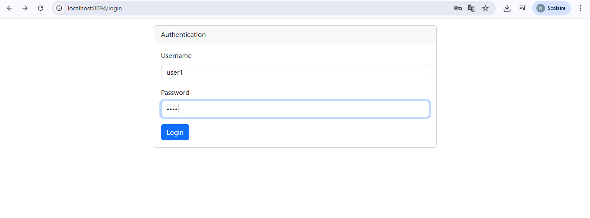
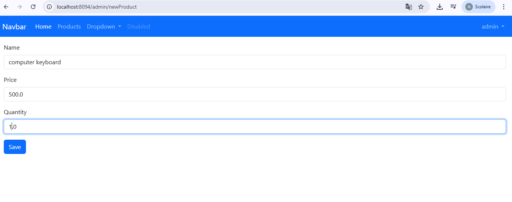

# GestionProduit_Spring-Thymeleaf

GestionProduit_Spring-Thymeleaf est une application web pour gérer des produits, développée avec **Java Spring Boot** et **Thymeleaf**. Ce projet permet d'ajouter, modifier, supprimer et lister des produits dans une interface web simple et intuitive.

---

## 🚀 Fonctionnalités

- Ajouter un produit avec ses détails (nom, description, prix, quantité…)
- Modifier les informations d’un produit existant
- Supprimer un produit
- Afficher la liste des produits dans un tableau
- Interface web dynamique avec **Thymeleaf**

---

## 🛠 Technologies utilisées

- **Java 17** : langage principal
- **Spring Boot** : framework pour le backend
- **Thymeleaf** : moteur de templates pour le frontend
- **Maven** : gestion des dépendances
- **Bootstrap 5** : pour le design responsive (optionnel selon ton projet)
- **H2/MySQL** : base de données (selon configuration)

---

## 📁 Structure du projet

GestionProduit_Spring-Thymeleaf/
│
├─ src/main/java/com/example/gestionproduit/ # Code source Java
│ ├─ controller/ # Contrôleurs Spring MVC
│ ├─ model/ # Entités et modèles
│ └─ repository/ # Repositories pour la BD
│
├─ src/main/resources/
│ ├─ templates/ # Pages Thymeleaf (.html)
│ └─ application.properties # Configuration Spring Boot
│
├─ pom.xml # Gestion Maven
└─ README.md # Ce fichier

## 💻 Prérequis

- Java 17 ou supérieur
- Maven installé
- Base de données configurée (H2 ou MySQL)
- IDE recommandé : IntelliJ IDEA ou Eclipse

---
## 🖼️ Captures d’écran

### Page d’accueil


### Liste des produits (utilisateur 1)


### Liste des produits (utilisateur 2)


### Login Admin


### Login User


### Ajout d’un produit (Admin)

 
---

## ⚡ Installation et lancement

1. **Cloner le dépôt :**

```bash
git clone https://github.com/najwamoukhliss/GestionProduit_Spring-Thymeleaf.git